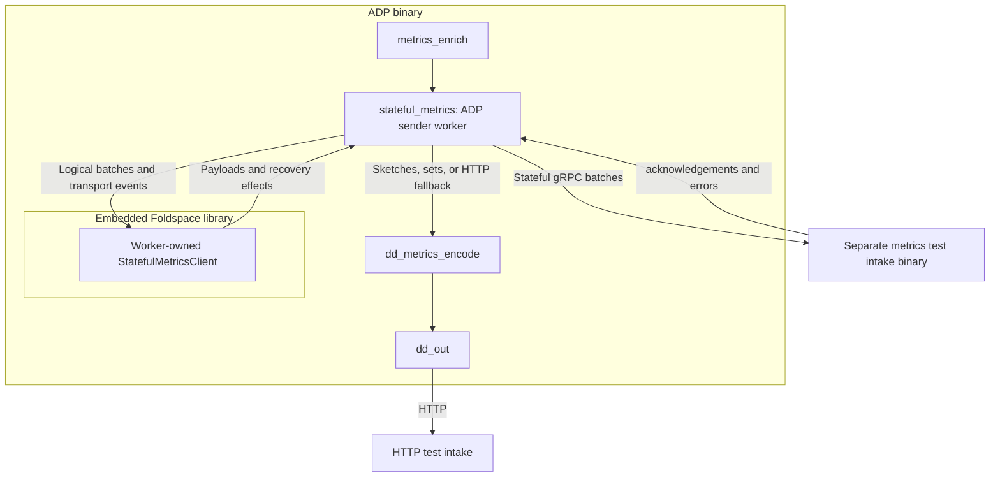

# Testing stateful metrics delivery

ADP embeds `foldspace-core` through a Cargo dependency pinned to the head of the
[Foldspace metrics stack](https://github.com/DataDog/foldspace/pull/50). You do not copy Foldspace
source into Saluki or run a separate client binary.

Each ADP sender worker task owns one `StatefulMetricsClient`, including its dictionaries and inflight
batches. Workers never share protocol state, even when they send to the same destination. This
initial topology starts one worker. Future sharding can route metric batches into additional worker
tasks, each with an independent gRPC stream. Workers do not require OS-thread affinity.



The library owns encoding, compression, dictionary state, ACK validation, and recovery decisions.
The ADP worker owns metric conversion, transport, credentials, timers, and the retry queue. It moves
the original metrics into an accompanying FIFO until ACK so HTTP fallback preserves the original
rate values, metadata, and context without cloning them. The logical representation retained by
Foldspace is a separate allocation.

## Build and configure

Build ADP from this branch:

```sh
cargo build --bin agent-data-plane
```

Building requires `protoc`, access to the private Foldspace Git repository, and access to the
Datadog Rust testing registry used by Foldspace's tokenizer dependency. The pinned Foldspace
revision is recorded in the workspace manifest and `Cargo.lock`.

For local testing, add this setting to your ADP configuration:

```yaml
data_plane:
  stateful_metrics_endpoint: http://127.0.0.1:8080
```

You can also set `DD_DATA_PLANE_STATEFUL_METRICS_ENDPOINT`. The endpoint must be a plaintext HTTP
origin without a path, query, or embedded credentials. It is a startup-only setting: restart ADP to
change it. Leaving it unset preserves the existing HTTP pipeline.

Run the separate **metrics-capable** Foldspace intake, then run ADP:

```sh
target/debug/agent-data-plane --config /path/to/datadog.yaml run
```

The logs-only `foldspace-intake` on the pinned Foldspace revision cannot decode metrics. The metrics
decoder/intake is a separate change; this branch tests transport behavior with a small gRPC fixture.
The server uses `datadog.intake.stateful.StatefulIntake/StatefulStream`, receives zstd-compressed
`MetricDatumSequence` payloads in `StatefulBatch`, and returns ordered `BatchStatus` messages.
ADP sends `dd-api-key`, `dd-content-encoding: zstd`, and `dd-state-request-bytes: 5242880` headers.

Configure the normal HTTP intake as well when testing sketches, sets, or fallback. Use a dummy API
key and local HTTP intake for isolated tests. With the normal Agent connection, ADP gets the API key
from its existing configuration stream. The test-only standalone mode can also drive this pipeline.

## Delivery behavior

- Count, rate, and gauge series use Foldspace after enrichment. Rate values use the existing V3
  normalization rules, including zero-interval rates. Resources, tags, origin, source type, and unit
  follow V3 serialization semantics. Non-finite points and empty series are excluded.
- Sets, histograms, and distributions continue through `dd_metrics_encode` and `dd_out`.
- Each worker holds at most 32 pending/inflight batches, with at most 8 inflight. A batch corresponds
  to one input event buffer. A full queue applies upstream backpressure; this can also delay sketches
  in the shared input path during an outage.
- Transient failures return logical batches in FIFO order and reconnect with exponential backoff
  from 250 milliseconds to 30 seconds. Only acknowledged dictionary state seeds the new stream;
  unacknowledged batches are encoded again. Ambiguous delivery can produce duplicates.
- Opening a stream times out after 10 seconds. Waiting for ACK progress times out after 30 seconds.
  Streams rotate after 15 minutes and drain for up to 5 seconds. Once input closes, shutdown allows
  up to 30 seconds to finish pending delivery, then reports any remaining batches as an error.
- `UNAUTHENTICATED` suspends stateful delivery and retains batches until the API key changes.
  Credential changes clear destination dictionary state and start a new stream.
- `INVALID_ARGUMENT` abandons returned speculative batches, counts them, and suspends delivery.
  Invalid ACK order instead retains returned batches and suspends delivery. Neither case schedules
  automatic reconnects. Correct the input/server problem and restart, or reset via a credential change.
- `FAILED_PRECONDITION` switches the worker to the existing stateless HTTP path. Returned and queued
  original metrics are forwarded in FIFO order, and subsequent metrics follow that path. This does
  not call the Foldspace `Stateless` RPC. A credential change starts a fresh stateful attempt.

Telemetry includes `stateful_metrics_batches_acked_total`, `stateful_metrics_stream_failures_total`
(with a failure-kind label), and `stateful_metrics_batches_abandoned_total`.

## Planned flush signal

The pinned Foldspace client immediately encodes each submitted logical batch. It does not yet expose
a partial-payload buffer or an explicit flush operation. The following contract is planned for the
separate Foldspace buffering change; it is not wired into this adapter yet.

Each ADP sender worker owns its flush timer and signals only its own Foldspace core. ADP uses
`shared.metrics_encoding.flush_timeout` (`flush_timeout_secs`, default 2 seconds), with the existing
encoder's 10 millisecond fallback when configured as zero. The countdown starts when a partial
payload first becomes pending. Later arrivals do not postpone the deadline, so continuous traffic
cannot indefinitely delay a partial payload.

On expiry, the worker calls an explicit sans-I/O flush operation and executes the returned transport
effects. Foldspace owns payload construction, size-triggered emission, and protocol state; it does
not own a clock or runtime task. The API must expose whether unsent buffered data remains, make an
empty flush harmless, and retain buffered data safely when a stream or inflight capacity is
unavailable. A requested flush must proceed when sending becomes possible without requiring another
metric to arrive. Shutdown also requests a flush before waiting for outstanding acknowledgements.

Buffering may combine or split ADP input batches. The API must preserve explicit ownership and
provide enough acceptance, acknowledgement, and recovery information for ADP to release or return
the corresponding original metrics. The current adapter's one-input-batch-per-acknowledgement FIFO
must be updated if that relationship changes. Unsent buffered metrics must also participate in
credential resets, retries, HTTP fallback, and queue limits.

Once the API is available, adapter tests should cover sparse input, continuous arrivals without
deadline extension, size-triggered emission, empty flushes, capacity recovery without new input,
shutdown, and independent worker timers.

## Scope and validation

This is an opt-in integration experiment. It supports one configured stateful destination and
rejects `additional_endpoints` rather than silently losing dual shipping. Existing MRF and
autoscaling-failover branches remain separate from the primary path. TLS, proxy support, durable
retries, and byte-based limits on dictionary and retained metric memory are not implemented.
The batch-count bounds are not a total memory bound. Do not enable this for production traffic.

Run the focused tests with:

```sh
cargo nextest run -p agent-data-plane -p agent-data-plane-config-system -E 'test(stateful_metrics)'
```

The tests cover conversion, HTTP routing, worker isolation, inflight backpressure, failure policies,
and real local gRPC exchanges for compression, acknowledgements, dictionary reuse, reconnect snapshots, replay,
and capability fallback. Full decoded-output correctness testing requires the separate metrics
intake implementation.
