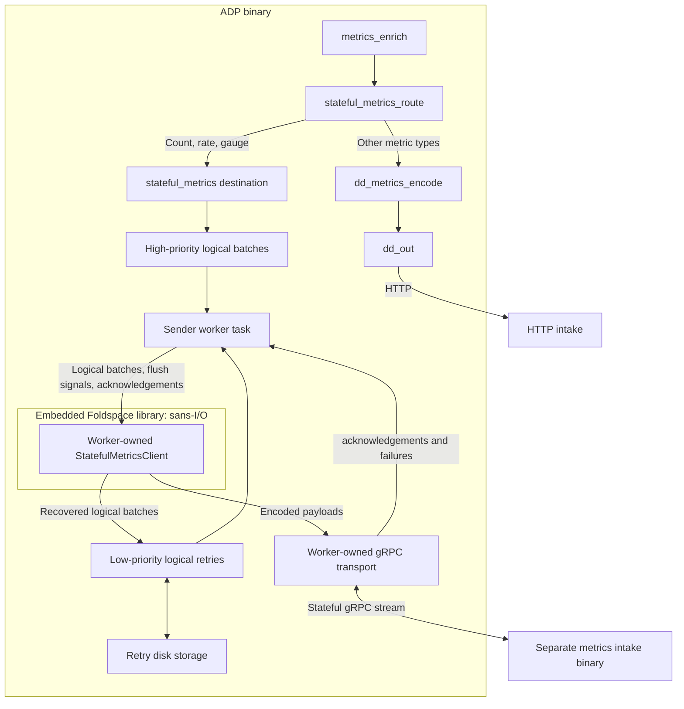

# Testing stateful metrics delivery

ADP embeds `foldspace-core` through a pinned Cargo dependency from the
[Foldspace metrics stack](https://github.com/DataDog/foldspace/pull/80). You do not copy Foldspace
source into Saluki or run a separate client binary.

Configuration selects delivery for count, rate, and gauge series. When the stateful endpoint is
configured, those series use the dedicated `stateful_metrics` destination. Other metric types
continue through the HTTP encoder. Stream failures never switch series delivery to HTTP.



Each sender worker task owns one core and one stream. Workers never share dictionaries or inflight
state. This topology starts one worker; future sharding can route metrics to additional workers.
Ownership is per async task, without OS-thread affinity. The transport is internal to the destination,
not a separate topology component, and never retries encoded payloads independently.

## Build and configure

Build ADP from this branch:

```sh
cargo build --bin agent-data-plane
```

Building requires `protoc`, access to the private Foldspace Git repository, and access to the
Datadog Rust testing registry used by Foldspace's tokenizer dependency. The pinned Foldspace
revision is recorded in the workspace manifest and `Cargo.lock`.

For local testing, add this setting to your ADP configuration:

```yaml
data_plane:
  stateful_metrics_endpoint: http://127.0.0.1:8080
```

You can also set `DD_DATA_PLANE_STATEFUL_METRICS_ENDPOINT`. The endpoint must be a plaintext HTTP
origin without a path, query, or embedded credentials. It is a startup-only setting: restart ADP to
change it. Leaving it unset preserves the existing HTTP pipeline.

From a Foldspace checkout at revision `560c5086c9bea00f36d5df05c5c32ab20c84802e`, build and run
its separate metrics intake binary:

```sh
cargo build -p foldspace-grpc-server --bin foldspace-intake
INTAKE_MODE=metrics LISTEN_ADDR=127.0.0.1:8080 JOURNAL_PATH=/tmp/foldspace-metrics.jsonl \
  target/debug/foldspace-intake
```

Then, from the ADP checkout, run ADP:

```sh
target/debug/agent-data-plane --config /path/to/datadog.yaml run
```

`INTAKE_MODE=metrics` is required: the intake defaults to logs. The JSONL journal records decoded
metric series for verification. The server uses `datadog.intake.stateful.StatefulIntake/StatefulStream`, receives zstd-compressed
`MetricDatumSequence` payloads in `StatefulBatch`, and returns ordered `BatchStatus` messages.
ADP sends `dd-api-key`, `dd-content-encoding: zstd`, and `dd-state-request-bytes: 5242880` headers.

Configure the normal HTTP intake as well when testing sketches or sets. Use a dummy API
key and local HTTP intake for isolated tests. With the normal Agent connection, ADP gets the API key
from its existing configuration stream. The test-only standalone mode can also drive this pipeline.

## Delivery and retry behavior

ADP converts enriched series once to self-contained `LogicalMetricBatch` values. Rate normalization,
resources, tags, origin, source type, and unit follow the V3 encoder's semantics. Non-finite points
and empty series are excluded. The sender does not retain original ADP `Metric` objects.

The destination reuses the HTTP forwarder's `PendingTransactions<T>` scheduling and `RetryQueue<T>`
storage machinery with a distinct logical-batch entry type:

- Fresh batches enter the high-priority queue. Overflow enters the low-priority queue.
- Recovery transfers unacknowledged and unsent partial logical batches into the low-priority queue.
- High-priority work is selected first. Low-priority memory entries are read before disk entries,
  following the existing queue's preference for recent data.
- Batches removed from the queue enter the worker's current core and are encoded again with the stateful protocol. Neither the
  retry entry nor its disk representation contains stream-specific IDs or encoded wire payloads.
- Foldspace retains inflight logical work until ACK or recovery. A successful channel enqueue is
  not a delivery acknowledgement. Lost acknowledgements can cause duplicates on retry.

Queue capacity, memory limits, disk location, disk limits, spill ratio, and file age use the existing
forwarder settings, including `forwarder_high_prio_buffer_size`,
`forwarder_retry_queue_payloads_max_size`, `forwarder_storage_path`, and
`forwarder_storage_max_size_in_bytes`. Queue byte accounting estimates the owned logical data,
including series, points, tags, and resource strings. This is not a total process memory bound.

Disk storage is enabled only when configured. Its directory is separate from HTTP transactions and
includes the logical format version, destination hash, and worker index. If requested storage cannot
be initialized, component startup fails. Overflow spills to disk; graceful shutdown flushes remaining
entries to disk. This is not a write-ahead log: a crash can lose memory-only and inflight work.
Without disk storage, overflow and shutdown can drop queued data. Queue evictions, oversized entries,
and spill failures are reported through drop accounting; a rejected entry does not stop the sender.
Shutdown persistence errors are returned to the component supervisor.

Transient failures reconnect with exponential backoff from 250 milliseconds to 30 seconds. The new
stream starts from acknowledged dictionary state and re-encodes work taken from the queue. The core allows up to
8 payloads inflight. A full transport channel retains the payload and waits for capacity while
continuing to receive acknowledgements. A closed channel fails the stream and recovers logical work.

`UNAUTHENTICATED` suspends delivery until the API key changes. Credential changes clear dictionary
state and restart delivery. `FAILED_PRECONDITION` and `UNIMPLEMENTED` also suspend delivery while
retaining logical retries: configuration does not permit automatic HTTP fallback. Correct the
endpoint and restart, or reset via a credential change. `INVALID_ARGUMENT` abandons the speculative
payloads returned under `DoNotRetry`, counts their points, and suspends delivery; unsent partial and
queued work remains recoverable. Invalid ACK order retains returned work and suspends delivery.

Opening a stream times out after 10 seconds; waiting for ACK progress times out after 30 seconds.
Streams rotate after 15 minutes and drain for up to 5 seconds. When input closes, the destination
flushes partial work and uses at most half the configured ADP stop budget (capped at 30 seconds)
waiting for delivery, leaving time for retry persistence. On timeout or suspended delivery,
it recovers remaining core-owned logical work and flushes the queue through its persistence path.

Telemetry includes `stateful_metrics_batches_acked_total`, `stateful_metrics_batches_retried_total`,
`stateful_metrics_stream_failures_total`, `stateful_metrics_batches_abandoned_total`, and
`stateful_metrics_points_dropped_total`, alongside the shared priority-queue telemetry.

## Worker flush timing

ADP owns the flush timer. The first logical batch accepted into a partial core buffer starts the
`flush_timeout_secs` countdown (default 2 seconds; zero uses 10 milliseconds). Later arrivals do not
postpone it. ADP calls `flush()` when the deadline expires or input closes. Foldspace also flushes
automatically at `max_metrics_per_payload`, which counts series rather than bytes. Empty flushes
emit nothing. Retries taken from the queue begin a new encoding attempt and get a new partial-batch deadline.
Foldspace itself reads no clock and creates no runtime task.

## Scope and validation

This is an opt-in plaintext integration experiment with one destination and one worker.
`additional_endpoints` is rejected. Existing MRF and autoscaling-failover branches remain separate
from this primary path. TLS, proxy support, sharding, and byte limits on core inflight data and
protocol dictionaries remain future work.

Run focused tests with:

```sh
cargo nextest run -p agent-data-plane -p agent-data-plane-config-system -E 'test(stateful_metrics)'
```

Tests cover routing, conversion, priority scheduling, disk spill/reload, shutdown recovery, worker
isolation, timer flushing, inflight limits, failure policies, and local gRPC exchanges. The gRPC tests
verify compression, acknowledgements, dictionary reuse, and re-encoding after reconnect. For decoded-output
validation, run the separate intake process and inspect its JSONL journal.

Keep decoder tests in the separate intake process: linking `foldspace-server` into ADP's test graph
currently enables `serde_json/arbitrary_precision`, which conflicts with ADP's configuration tests.
