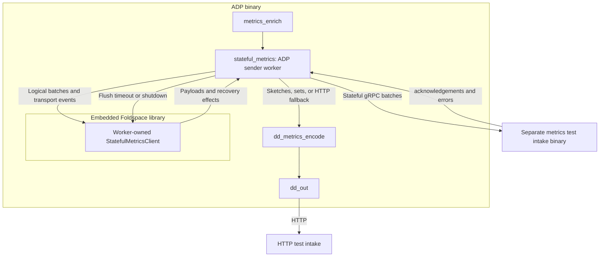

# Testing stateful metrics delivery

ADP embeds `foldspace-core` through a Cargo dependency pinned to the head of the
[Foldspace metrics stack](https://github.com/DataDog/foldspace/pull/80). You do not copy Foldspace
source into Saluki or run a separate client binary.

Each ADP sender worker task owns one `StatefulMetricsClient`, including its dictionaries and inflight
batches. Workers never share protocol state, even when they send to the same destination. This
initial topology starts one worker. Future sharding can route metric batches into additional worker
tasks, each with an independent gRPC stream. Workers do not require OS-thread affinity.



The library owns encoding, compression, dictionary state, ACK validation, and recovery decisions.
The ADP worker owns metric conversion, transport, credentials, timers, and the retry queue. It moves
the original metrics into a partial buffer and then a FIFO of emitted payloads until ACK, so HTTP
fallback preserves the original rate values, metadata, and context without cloning them. Several
input buffers can share one payload and acknowledgement. The logical representation retained by
Foldspace is a separate allocation.

## Build and configure

Build ADP from this branch:

```sh
cargo build --bin agent-data-plane
```

Building requires `protoc`, access to the private Foldspace Git repository, and access to the
Datadog Rust testing registry used by Foldspace's tokenizer dependency. The pinned Foldspace
revision is recorded in the workspace manifest and `Cargo.lock`.

For local testing, add this setting to your ADP configuration:

```yaml
data_plane:
  stateful_metrics_endpoint: http://127.0.0.1:8080
```

You can also set `DD_DATA_PLANE_STATEFUL_METRICS_ENDPOINT`. The endpoint must be a plaintext HTTP
origin without a path, query, or embedded credentials. It is a startup-only setting: restart ADP to
change it. Leaving it unset preserves the existing HTTP pipeline.

From a Foldspace checkout at revision `560c5086c9bea00f36d5df05c5c32ab20c84802e`, build and run
its separate metrics intake binary:

```sh
cargo build -p foldspace-grpc-server --bin foldspace-intake
INTAKE_MODE=metrics LISTEN_ADDR=127.0.0.1:8080 JOURNAL_PATH=/tmp/foldspace-metrics.jsonl \
  target/debug/foldspace-intake
```

Then, from the ADP checkout, run ADP:

```sh
target/debug/agent-data-plane --config /path/to/datadog.yaml run
```

`INTAKE_MODE=metrics` is required: the intake defaults to logs. The JSONL journal records decoded
metric series for verification. The server uses `datadog.intake.stateful.StatefulIntake/StatefulStream`, receives zstd-compressed
`MetricDatumSequence` payloads in `StatefulBatch`, and returns ordered `BatchStatus` messages.
ADP sends `dd-api-key`, `dd-content-encoding: zstd`, and `dd-state-request-bytes: 5242880` headers.

Configure the normal HTTP intake as well when testing sketches, sets, or fallback. Use a dummy API
key and local HTTP intake for isolated tests. With the normal Agent connection, ADP gets the API key
from its existing configuration stream. The test-only standalone mode can also drive this pipeline.

## Delivery behavior

- Count, rate, and gauge series use Foldspace after enrichment. Rate values use the existing V3
  normalization rules, including zero-interval rates. Resources, tags, origin, source type, and unit
  follow V3 serialization semantics. Non-finite points and empty series are excluded.
- Sets, histograms, and distributions continue through `dd_metrics_encode` and `dd_out`.
- Each worker retains metrics from at most 32 input event buffers across its queue, partial payload,
  and inflight payloads, with at most 8 payloads inflight. Combining inputs does not release capacity;
  acknowledgement or abandonment does. A full queue applies upstream backpressure, which can also
  delay sketches in the shared input path during an outage.
- Transient failures return logical batches in FIFO order and reconnect with exponential backoff
  from 250 milliseconds to 30 seconds. Only acknowledged dictionary state seeds the new stream;
  unacknowledged batches are encoded again. Ambiguous delivery can produce duplicates.
- Opening a stream times out after 10 seconds. Waiting for ACK progress times out after 30 seconds.
  Streams rotate after 15 minutes and drain for up to 5 seconds. Once input closes, shutdown allows
  up to 30 seconds to finish pending delivery, then reports any remaining batches as an error.
- `UNAUTHENTICATED` suspends stateful delivery and retains batches until the API key changes.
  Credential changes clear destination dictionary state and start a new stream.
- `INVALID_ARGUMENT` abandons returned speculative payloads, counts them, and suspends delivery.
  Unsent partial metrics and queued input are retained. Invalid ACK order instead retains all
  returned metrics and suspends delivery. Neither case schedules
  automatic reconnects. Correct the input/server problem and restart, or reset via a credential change.
- `FAILED_PRECONDITION` switches the worker to the existing stateless HTTP path. Returned and queued
  original metrics are forwarded in FIFO order, and subsequent metrics follow that path. This does
  not call the Foldspace `Stateless` RPC. A credential change starts a fresh stateful attempt.

Telemetry includes `stateful_metrics_batches_acked_total`, `stateful_metrics_stream_failures_total`
(with a failure-kind label), and `stateful_metrics_batches_abandoned_total`.

## Worker flush timing

Each sender worker calls `push_batch` for normal input. Foldspace combines accepted series until
`shared.metrics_encoding.max_metrics_per_payload` (`max_metrics_per_payload`) is reached, then
emits a payload automatically. The threshold counts series, not bytes, and one input buffer can
exceed it.

ADP owns each worker's timer and uses `shared.metrics_encoding.flush_timeout` (`flush_timeout_secs`,
default 2 seconds). Zero uses the existing encoder's 10 millisecond fallback. The countdown starts
with the first pending metrics. Later arrivals do not postpone that deadline, so continuous traffic
cannot indefinitely delay a partial payload. The worker calls `flush()` when the deadline expires;
no further input is required. Empty flushes emit nothing.

Deadlines follow original metrics through queueing and recovery. If a deadline expires while
waiting for an open stream or inflight capacity, the worker flushes when capacity returns without
waiting for new input. Timer selection is disabled while sending is unavailable to avoid a busy
loop. Shutdown flushes partial metrics before waiting for acknowledgements, including work that
can be sent later during shutdown.

The adapter tracks original metrics per emitted payload, including automatic threshold flushes and
encoding failures. Recovery restores inflight payloads first, then the unsent partial batch from
`ReturnBuffered`, then newer queued input. Credential reset, rotation, invalid acknowledgements,
and HTTP fallback all preserve that order. Foldspace owns encoding and protocol state and never
reads a clock or creates a runtime task.

## Scope and validation

This is an opt-in integration experiment. It supports one configured stateful destination and
rejects `additional_endpoints` rather than silently losing dual shipping. Existing MRF and
autoscaling-failover branches remain separate from the primary path. TLS, proxy support, durable
retries, and byte-based limits on dictionary and retained metric memory are not implemented.
The batch-count bounds are not a total memory bound. Do not enable this for production traffic.

Run the focused tests with:

```sh
cargo nextest run -p agent-data-plane -p agent-data-plane-config-system -E 'test(stateful_metrics)'
```

The tests cover conversion, HTTP routing, worker isolation, inflight backpressure, failure policies,
and real local gRPC exchanges for compression, acknowledgements, dictionary reuse, reconnect snapshots,
replay, and capability fallback. Flush tests cover sparse input, continuous arrivals without deadline
extension, threshold emission, coalesced ownership, recovery without new input, shutdown, and
independent worker timers. For decoded-output validation, run the separate intake process and inspect
its JSONL journal. A local smoke test sent a gauge of 7 and a counter of 30 through DogStatsD with no
subsequent input; the intake received the gauge and a rate of 3 over a 10-second interval, preserving
tags and the host resource. Both binaries shut down cleanly.

Keep decoder tests in the separate intake process: linking `foldspace-server` into ADP's test graph
currently enables `serde_json/arbitrary_precision`, which conflicts with ADP's configuration tests.
