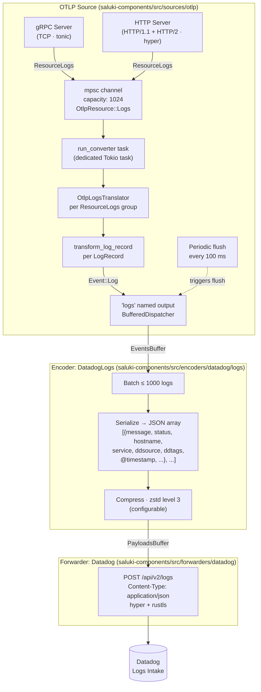

# Log Pipeline Architecture

This document traces the full lifecycle of a log event through Saluki — from ingestion to delivery to the Datadog backend.

## Table of Contents

- [Overview](#overview)
- [Architecture Diagrams](#architecture-diagrams)
  - [ASCII](#ascii)
  - [Mermaid](#mermaid)
- [Stage-by-Stage Breakdown](#stage-by-stage-breakdown)
  - [1. Ingestion (OTLP Source)](#1-ingestion-otlp-source)
  - [2. Translation (run_converter)](#2-translation-run_converter)
  - [3. OtlpLogsTranslator](#3-otlplogtranslator)
  - [4. transform_log_record](#4-transform_log_record)
  - [5. Encoding (DatadogLogs)](#5-encoding-datadoglogs)
  - [6. Forwarding (Datadog Forwarder)](#6-forwarding-datadog-forwarder)
- [Building the Minimal Binary (otlp-log-agent)](#building-the-minimal-binary-otlp-log-agent)
  - [Configuration](#configuration)
  - [Development build](#development-build)
  - [Optimized build for AL2023 / Lambda (x86_64)](#optimized-build-for-al2023--lambda-x86_64)
  - [Optimized build for AL2023 / Lambda (arm64 / Graviton)](#optimized-build-for-al2023--lambda-arm64--graviton)
  - [Why musl?](#why-musl)
  - [Binary size breakdown](#binary-size-breakdown)
- [Internal Data Model](#internal-data-model)
- [Key Design Decisions](#key-design-decisions)

## Overview

Saluki processes logs exclusively via the **OTLP source**. Logs enter over gRPC or HTTP, are translated from the OTLP data model into Saluki's internal `Log` type, buffered through the topology's async channel system, serialized into a Datadog Logs API payload, and finally forwarded to `POST /api/v2/logs`.

There are currently no transform components in the log path — the pipeline is:

```
OTLP source → Encoder (Datadog Logs) → Forwarder (Datadog)
```

---

## Architecture Diagrams

### ASCII

```
  ┌──────────────────────────────────────────────────────────────┐
  │                        OTLP Source                           │
  │                                                              │
  │  ┌─────────────────┐   ┌──────────────────────────────────┐  │
  │  │   gRPC Server   │   │          HTTP Server             │  │
  │  │  (TCP, tonic)   │   │   (HTTP/1.1 + HTTP/2, hyper)     │  │
  │  └────────┬────────┘   └────────────────┬─────────────────┘  │
  │           │                             │                     │
  │           └──────────────┬──────────────┘                     │
  │                          │ OtlpResource::Logs(ResourceLogs)   │
  │                          ▼                                    │
  │              ┌───────────────────────┐                        │
  │              │  mpsc channel (1024)  │                        │
  │              └───────────┬───────────┘                        │
  │                          │                                    │
  │                          ▼                                    │
  │              ┌───────────────────────┐                        │
  │              │  run_converter task   │  ← flush every 100ms  │
  │              │                       │                        │
  │              │  OtlpLogsTranslator   │                        │
  │              │  (per ResourceLogs)   │                        │
  │              │                       │                        │
  │              │  transform_log_record │                        │
  │              │  (per LogRecord)      │                        │
  │              └───────────┬───────────┘                        │
  │                          │ Event::Log(Log)                    │
  │                          ▼                                    │
  │              ┌───────────────────────┐                        │
  │              │  "logs" named output  │  ← BufferedDispatcher  │
  │              └───────────┬───────────┘                        │
  └──────────────────────────┼───────────────────────────────────┘
                             │ EventsBuffer (async channel)
                             ▼
  ┌──────────────────────────────────────────────────────────────┐
  │              Encoder: DatadogLogs                            │
  │                                                              │
  │  • Batches up to 1000 logs per payload                       │
  │  • Serializes each Log → JSON object                         │
  │  • Wraps batch as JSON array  [ {...}, {...} ]               │
  │  • Compresses with zstd (level 3, configurable)              │
  └───────────────────────┬──────────────────────────────────────┘
                          │ Payload::Http (HttpPayload)
                          │ PayloadsBuffer (async channel)
                          ▼
  ┌──────────────────────────────────────────────────────────────┐
  │              Forwarder: Datadog                              │
  │                                                              │
  │  POST /api/v2/logs                                           │
  │  Content-Type: application/json                              │
  │  Transport: hyper + rustls (TLS)                             │
  └──────────────────────────────────────────────────────────────┘
```

### Mermaid



---

## Stage-by-Stage Breakdown

### 1. Ingestion (OTLP Source)

**File:** `lib/saluki-components/src/sources/otlp/mod.rs`

The OTLP source runs two network servers sharing a single internal `mpsc` channel (capacity 1024):

| Protocol | Transport | Handler |
|----------|-----------|---------|
| gRPC | TCP (tonic) | `ExportLogsServiceRequest` (protobuf) |
| HTTP | TCP (hyper, HTTP/1.1 + HTTP/2) | Same protobuf over HTTP |

`SourceHandler` decodes incoming protobuf bytes with `prost` and sends each `ResourceLogs` item to the channel as `OtlpResource::Logs(resource_logs)`.

The OTLP source declares **three named outputs**:

```
"metrics" → EventType::Metric
"logs"    → EventType::Log
"traces"  → EventType::Trace
```

This lets the topology route each signal independently — logs do not share a channel with metrics or traces.

---

### 2. Translation (run_converter)

**File:** `lib/saluki-components/src/sources/otlp/mod.rs` — `run_converter`

A dedicated Tokio task drains the internal channel. It also ticks a **100 ms flush timer** to ensure buffered events are always emitted even at low load, preventing events from sitting in the dispatcher buffer indefinitely.

When an `OtlpResource::Logs(resource_logs)` arrives, an `OtlpLogsTranslator` is constructed for that batch and iterated to completion before the next item is processed.

---

### 3. OtlpLogsTranslator

**File:** `lib/saluki-components/src/sources/otlp/logs/translator.rs`

A lazy iterator that walks the OTLP nesting hierarchy:

```
ResourceLogs
  └── ScopeLogs[]
        └── LogRecord[]
```

**Per ResourceLogs group**, extracted once and shared across all records:

- `host.name` resource attribute → `Log.hostname`
- `service.name` resource attribute → `Log.service`
- All resource attributes → converted to `SharedTagSet` + `additional_properties`
- `otel_source:datadog_agent` tag always inserted

Origin enrichment (container/pod tags) is applied here if a `WorkloadProvider` is configured.

---

### 4. transform_log_record

**File:** `lib/saluki-components/src/sources/otlp/logs/transform.rs`

A **single pass** over each `LogRecord`'s attributes dispatches on the key name:

| Attribute key(s) | Action |
|------------------|--------|
| `msg`, `message`, `log` | Sets `Log.message` |
| `status`, `severity`, `level`, `syslog.severity` | Drives status derivation |
| `traceid`, `trace_id`, `contextmap.traceid`, `oteltraceid` | Inserts `otel.trace_id` (hex) + `dd.trace_id` (u64 decimal) |
| `spanid`, `span_id`, `contextmap.spanid`, `otelspanid` | Inserts `otel.span_id` (hex) + `dd.span_id` (u64 decimal) |
| `ddtags` | Parsed as comma-separated, merged into `SharedTagSet` |
| `hostname`, `service` | Inserted as `otel.hostname` / `otel.service` to avoid clobbering DD fields |
| anything else | Flattened to dot-notation keys, up to depth 10 (e.g. `root.a.b.c`); deeper nesting is JSON-stringified |

Scope attributes and resource attributes are appended to `additional_properties` after the record pass.

Trace/span IDs from OTLP's binary fields (`LogRecord.trace_id`, `LogRecord.span_id`) are processed after the attribute pass, taking precedence over attribute-based IDs.

**Status derivation priority** (`derive_status`):

```
1. status/level text from attributes (e.g. level="error")
2. OTLP severity_text field
3. OTLP severity_number  →  1-4: Trace, 5-8: Debug, 9-12: Info,
                             13-16: Warning, 17-20: Error, 21-24: Fatal
```

**Message selection:**

```
1. Value of msg/message/log attribute (if present)
2. LogRecord.body (converted to string; non-string body is JSON-serialized)
3. Empty string (fallback)
```

**Timestamps** (when `LogRecord.time_unix_nano != 0`):

- `otel.timestamp` → raw nanosecond integer as string
- `@timestamp` → ISO 8601 formatted (`2006-01-02T15:04:05.000Z`)

**Nesting limit:** Nested `KvListValue` attributes are flattened up to depth 10. Keys beyond that depth are JSON-stringified at the truncation boundary:

```
# Depth ≤ 10 → dot-notation
root.a.b.c = "val"

# Depth > 10 → serialized at depth 10 boundary
root.a.b.c.d.e.f.g.h.i.j = "{\"k\":\"val\"}"
```

---

### 5. Encoding (DatadogLogs)

**File:** `lib/saluki-components/src/encoders/datadog/logs/mod.rs`

The encoder receives `Event::Log` values from the `"logs"` channel and builds Datadog Logs API payloads.

**Serialized JSON shape per log:**

```json
{
  "message": "{\"message\":\"log body\",\"service\":\"my-svc\"}",
  "status": "Info",
  "hostname": "my-host",
  "service": "my-svc",
  "ddsource": "otlp_log_ingestion",
  "ddtags": "otel_source:datadog_agent,env:prod",
  "@timestamp": "2024-01-01T00:00:00.000Z",

  // additional_properties merged last (last-write-wins):
  "otel.trace_id": "0102030405060708...",
  "dd.trace_id": "506097522914230800",
  "app": "my-app",
  "otel.severity_number": "9"
}
```

Notes:
- The `message` field is a **JSON-encoded string** wrapping both `message` and `service` — this is the Datadog Agent intake convention.
- `additional_properties` are merged last and will overwrite top-level fields if keys collide.
- Tags are **deduplicated** before joining as `ddtags`.
- If neither `timestamp` nor `@timestamp` is in `additional_properties`, `@timestamp` is set to `Utc::now()`.

**Batching and compression:**

| Parameter | Default | Config key |
|-----------|---------|------------|
| Max logs per payload | 1000 | `MAX_LOGS_PER_PAYLOAD` (code constant) |
| Compression | zstd level 3 | `serializer_compressor_kind`, `serializer_zstd_compressor_level` |

Payloads are structured as a JSON array: `[{...}, {...}, ...]`

When a payload is full (by count or byte limit), or when the encoder's `flush` is called, the batch is compressed and dispatched as a `Payload::Http` onto the payload channel.

---

### 6. Forwarding (Datadog Forwarder)

**File:** `lib/saluki-components/src/forwarders/datadog/mod.rs`

```
POST /api/v2/logs
Content-Type: application/json
Content-Encoding: zstd (or gzip, depending on config)
```

Transport: `hyper` + `rustls` (TLS). The forwarder handles retries, proxy support, and API key injection.

---

## Internal Data Model

**`Log` struct** (`lib/saluki-core/src/data_model/event/log/mod.rs`):

| Field | Type | Description |
|-------|------|-------------|
| `message` | `MetaString` | Log body |
| `status` | `Option<LogStatus>` | Normalized severity |
| `source` | `Option<MetaString>` | `ddsource` field (always `"otlp_log_ingestion"`) |
| `hostname` | `MetaString` | Host identifier |
| `service` | `MetaString` | Service name |
| `tags` | `SharedTagSet` | Tag set (shared, ref-counted) |
| `additional_properties` | `HashMap<MetaString, JsonValue>` | All other attributes |

`MetaString` is an optimized string type from `lib/stringtheory` that avoids heap allocations for interned or static strings. `SharedTagSet` is ref-counted and copy-on-write, enabling efficient sharing of resource-level tags across many log records from the same batch.

---

## Building the Minimal Binary (`otlp-log-agent`)

`bin/otlp-log-agent` is a standalone binary that implements only the log pipeline above. It is ~5–6× smaller than the full `agent-data-plane` binary, making it suitable for embedding in a Lambda extension or any size-constrained environment.

### Configuration

All configuration is read from `DD_*` environment variables — no YAML file required.

| Variable | Default | Description |
|----------|---------|-------------|
| `DD_API_KEY` | *(required)* | Datadog API key |
| `DD_SITE` | `datadoghq.com` | Datadog site |
| `DD_DD_URL` | *(derived from site)* | Override intake URL |
| `DD_HOSTNAME` | *(system hostname)* | Host tag on logs |
| `DD_LOG_LEVEL` | `info` | Log verbosity |
| `DD_OTLP_CONFIG_RECEIVER_PROTOCOLS_GRPC_ENDPOINT` | `0.0.0.0:4317` | gRPC listen address |
| `DD_OTLP_CONFIG_RECEIVER_PROTOCOLS_HTTP_ENDPOINT` | `0.0.0.0:4318` | HTTP listen address |

For Lambda, set the endpoints to `127.0.0.1:4317` / `127.0.0.1:4318` so only the Lambda function itself can reach the agent.

### Development build

```bash
cargo build --package otlp-log-agent
# binary: target/debug/otlp-log-agent
```

### Optimized build for AL2023 / Lambda (x86_64)

Uses fat LTO + single codegen unit + musl static linking:

```bash
# One-time setup
rustup target add x86_64-unknown-linux-musl
brew install FiloSottile/musl-cross/musl-cross   # macOS cross-linker

# Build
CC=x86_64-linux-musl-gcc \
  CARGO_TARGET_X86_64_UNKNOWN_LINUX_MUSL_LINKER=x86_64-linux-musl-gcc \
  cargo build \
    --package otlp-log-agent \
    --profile optimized-release \
    --target x86_64-unknown-linux-musl

# Strip debug symbols (profile has debug = true by default)
x86_64-linux-musl-strip target/x86_64-unknown-linux-musl/optimized-release/otlp-log-agent
```

**Output:** `target/x86_64-unknown-linux-musl/optimized-release/otlp-log-agent`

**Stripped binary size: ~17 MB** (statically linked, no external libc dependency).

### Optimized build for AL2023 / Lambda (arm64 / Graviton)

```bash
rustup target add aarch64-unknown-linux-musl
# macOS cross-linker for arm64:
brew install aarch64-linux-musl-cross   # or use `cross` (Docker-based)

CC=aarch64-linux-musl-gcc \
  CARGO_TARGET_AARCH64_UNKNOWN_LINUX_MUSL_LINKER=aarch64-linux-musl-gcc \
  cargo build \
    --package otlp-log-agent \
    --profile optimized-release \
    --target aarch64-unknown-linux-musl

aarch64-linux-musl-strip target/aarch64-unknown-linux-musl/optimized-release/otlp-log-agent
```

### Why musl?

Static linking — the binary runs on any Linux kernel version without depending on the host glibc. This is the right choice for `provided.al2023`, `scratch` containers, or Lambda layers where glibc version pinning is a common source of runtime failures.

### Binary size breakdown

| Component | Notes |
|-----------|-------|
| jemalloc | ~2 MB — statically linked on Linux; swap `[cfg(system_allocator)]` to save this |
| aws-lc-sys (BoringSSL) | ~3–4 MB — required for TLS; unavoidable without changing the TLS backend |
| saluki pipeline logic | remainder |

The full `agent-data-plane` is typically 80–100 MB stripped. The `otlp-log-agent` saves size by excluding: DogStatsD codec, APM pipeline, OTTL transform engine, and all correctness tooling.

---

## Key Design Decisions

**Decoupled ingestion and translation via internal channel.** The two network servers (gRPC + HTTP) write into a single `mpsc(1024)` channel. A single converter task reads from it sequentially. This avoids locking during translation, keeps translation logic single-threaded and cache-friendly, and provides natural backpressure — the servers block when the channel is full.

**Named outputs for signal multiplexing.** The OTLP source uses named outputs (`"metrics"`, `"logs"`, `"traces"`) rather than a single default output. This means each signal type has its own dedicated downstream channel, so a slow log consumer cannot stall metric delivery.

**Single-pass attribute processing.** `transform_log_record` iterates over `LogRecord.attributes` exactly once, dispatching on the (lowercased) key. There is no post-processing pass. This keeps translation O(n) in the number of attributes.

**Flat `Event` enum, not a trait object.** All signal types (`Metric`, `Log`, `Trace`, etc.) are variants of a single `enum Event`. This avoids vtable dispatch overhead in the hot path — the compiler can monomorphize the dispatch at each component boundary.

**100 ms flush timer.** Without it, a log arriving just before the buffer fills would wait indefinitely at low throughput since the dispatcher only auto-flushes on a full buffer. The timer guarantees bounded latency regardless of load.
